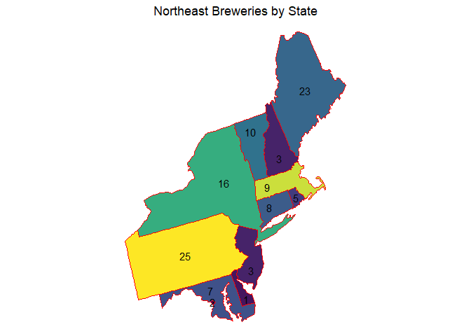
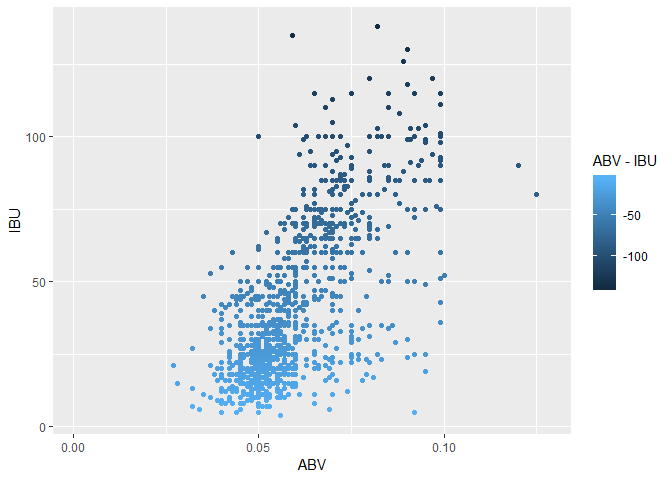

# Introduction
Our team was presented the raw data on U.S. microbrewery beers provided by the market research department, and asked asked to analyze the data for patterns that could be used in developing new marketing opportunities.

In particular we were asked to tally and vizualize the number of craft breweries by state, summarize the statistical parameters of alcohol and bitterness, and the relationships of these parameters with each other and with the States in which they were produced. 

# Analysis

### Microbreweries by State
<!-- --><!-- --><!-- --><!-- --><!-- --><!-- -->

### Merged Beer and Brewery Data Summary
<table class="table table-striped table-condensed" style="font-size: 10px; width: auto !important; ">
 <thead>
  <tr>
   <th style="text-align:left;"> Brewery </th>
   <th style="text-align:left;"> City </th>
   <th style="text-align:left;"> State </th>
   <th style="text-align:left;"> Beer </th>
   <th style="text-align:left;"> ABV </th>
   <th style="text-align:left;"> IBU </th>
   <th style="text-align:left;"> Style </th>
   <th style="text-align:left;"> Ounces </th>
  </tr>
 </thead>
<tbody>
  <tr grouplength="6"><td colspan="8" style="text-align: center"><strong>Top Six Observations</strong></td></tr>
<tr>
   <td style="text-align:left; padding-left: 2em;" indentlevel="1"> NorthGate Brewing </td>
   <td style="text-align:left;"> Minneapolis </td>
   <td style="text-align:left;"> MN </td>
   <td style="text-align:left;"> Pumpion </td>
   <td style="text-align:left;"> 0.060 </td>
   <td style="text-align:left;"> 38 </td>
   <td style="text-align:left;"> Pumpkin Ale </td>
   <td style="text-align:left;"> 16 </td>
  </tr>
  <tr>
   <td style="text-align:left; padding-left: 2em;" indentlevel="1"> NorthGate Brewing </td>
   <td style="text-align:left;"> Minneapolis </td>
   <td style="text-align:left;"> MN </td>
   <td style="text-align:left;"> Stronghold </td>
   <td style="text-align:left;"> 0.060 </td>
   <td style="text-align:left;"> 25 </td>
   <td style="text-align:left;"> American Porter </td>
   <td style="text-align:left;"> 16 </td>
  </tr>
  <tr>
   <td style="text-align:left; padding-left: 2em;" indentlevel="1"> NorthGate Brewing </td>
   <td style="text-align:left;"> Minneapolis </td>
   <td style="text-align:left;"> MN </td>
   <td style="text-align:left;"> Parapet ESB </td>
   <td style="text-align:left;"> 0.056 </td>
   <td style="text-align:left;"> 47 </td>
   <td style="text-align:left;"> Extra Special / Strong Bitter (ESB) </td>
   <td style="text-align:left;"> 16 </td>
  </tr>
  <tr>
   <td style="text-align:left; padding-left: 2em;" indentlevel="1"> NorthGate Brewing </td>
   <td style="text-align:left;"> Minneapolis </td>
   <td style="text-align:left;"> MN </td>
   <td style="text-align:left;"> Get Together </td>
   <td style="text-align:left;"> 0.045 </td>
   <td style="text-align:left;"> 50 </td>
   <td style="text-align:left;"> American IPA </td>
   <td style="text-align:left;"> 16 </td>
  </tr>
  <tr>
   <td style="text-align:left; padding-left: 2em;" indentlevel="1"> NorthGate Brewing </td>
   <td style="text-align:left;"> Minneapolis </td>
   <td style="text-align:left;"> MN </td>
   <td style="text-align:left;"> Maggie's Leap </td>
   <td style="text-align:left;"> 0.049 </td>
   <td style="text-align:left;"> 26 </td>
   <td style="text-align:left;"> Milk / Sweet Stout </td>
   <td style="text-align:left;"> 16 </td>
  </tr>
  <tr>
   <td style="text-align:left; padding-left: 2em;" indentlevel="1"> NorthGate Brewing </td>
   <td style="text-align:left;"> Minneapolis </td>
   <td style="text-align:left;"> MN </td>
   <td style="text-align:left;"> Wall's End </td>
   <td style="text-align:left;"> 0.048 </td>
   <td style="text-align:left;"> 19 </td>
   <td style="text-align:left;"> English Brown Ale </td>
   <td style="text-align:left;"> 16 </td>
  </tr>
  <tr grouplength="6"><td colspan="8" style="text-align: center"><strong>Bottom Six Observations</strong></td></tr>
<tr>
   <td style="text-align:left; padding-left: 2em;" indentlevel="1"> Tröegs Brewing Company </td>
   <td style="text-align:left;"> Hershey </td>
   <td style="text-align:left;"> PA </td>
   <td style="text-align:left;"> Perpetual IPA </td>
   <td style="text-align:left;"> 0.075 </td>
   <td style="text-align:left;"> 85 </td>
   <td style="text-align:left;"> American IPA </td>
   <td style="text-align:left;"> 12 </td>
  </tr>
  <tr>
   <td style="text-align:left; padding-left: 2em;" indentlevel="1"> Tröegs Brewing Company </td>
   <td style="text-align:left;"> Hershey </td>
   <td style="text-align:left;"> PA </td>
   <td style="text-align:left;"> Troegenator Doublebock </td>
   <td style="text-align:left;"> 0.082 </td>
   <td style="text-align:left;"> 25 </td>
   <td style="text-align:left;"> Doppelbock </td>
   <td style="text-align:left;"> 16 </td>
  </tr>
  <tr>
   <td style="text-align:left; padding-left: 2em;" indentlevel="1"> Mission Brewery </td>
   <td style="text-align:left;"> San Diego </td>
   <td style="text-align:left;"> CA </td>
   <td style="text-align:left;"> Cortez Gold </td>
   <td style="text-align:left;"> 0.050 </td>
   <td style="text-align:left;"> NA </td>
   <td style="text-align:left;"> Belgian Pale Ale </td>
   <td style="text-align:left;"> 32 </td>
  </tr>
  <tr>
   <td style="text-align:left; padding-left: 2em;" indentlevel="1"> Mission Brewery </td>
   <td style="text-align:left;"> San Diego </td>
   <td style="text-align:left;"> CA </td>
   <td style="text-align:left;"> Mission IPA </td>
   <td style="text-align:left;"> 0.068 </td>
   <td style="text-align:left;"> 66 </td>
   <td style="text-align:left;"> American IPA </td>
   <td style="text-align:left;"> 32 </td>
  </tr>
  <tr>
   <td style="text-align:left; padding-left: 2em;" indentlevel="1"> Mission Brewery </td>
   <td style="text-align:left;"> San Diego </td>
   <td style="text-align:left;"> CA </td>
   <td style="text-align:left;"> El Conquistador Extra Pale Ale </td>
   <td style="text-align:left;"> 0.048 </td>
   <td style="text-align:left;"> 44 </td>
   <td style="text-align:left;"> American Pale Ale (APA) </td>
   <td style="text-align:left;"> 32 </td>
  </tr>
  <tr>
   <td style="text-align:left; padding-left: 2em;" indentlevel="1"> Mission Brewery </td>
   <td style="text-align:left;"> San Diego </td>
   <td style="text-align:left;"> CA </td>
   <td style="text-align:left;"> Shipwrecked Double IPA </td>
   <td style="text-align:left;"> 0.092 </td>
   <td style="text-align:left;"> 75 </td>
   <td style="text-align:left;"> American Double / Imperial IPA </td>
   <td style="text-align:left;"> 32 </td>
  </tr>
</tbody>
</table>

### NA's Report
<table class="table table-striped table-condensed" style="font-size: 10px; width: auto !important; ">
<caption style="font-size: initial !important;">NA, Not NA, Null and Unique Total Counts</caption>
 <thead>
  <tr>
   <th style="text-align:left;"> Column </th>
   <th style="text-align:left;"> NA_totals </th>
   <th style="text-align:left;"> Not_NA_totals </th>
   <th style="text-align:left;"> Null_totals </th>
   <th style="text-align:left;"> Unique_totals </th>
  </tr>
 </thead>
<tbody>
  <tr>
   <td style="text-align:left;"> Brewery_ID </td>
   <td style="text-align:left;"> 0 </td>
   <td style="text-align:left;"> 2410 </td>
   <td style="text-align:left;"> 0 </td>
   <td style="text-align:left;"> 558 </td>
  </tr>
  <tr>
   <td style="text-align:left;"> Brewery_Name </td>
   <td style="text-align:left;"> 0 </td>
   <td style="text-align:left;"> 2410 </td>
   <td style="text-align:left;"> 0 </td>
   <td style="text-align:left;"> 551 </td>
  </tr>
  <tr>
   <td style="text-align:left;"> City </td>
   <td style="text-align:left;"> 0 </td>
   <td style="text-align:left;"> 2410 </td>
   <td style="text-align:left;"> 0 </td>
   <td style="text-align:left;"> 384 </td>
  </tr>
  <tr>
   <td style="text-align:left;"> State </td>
   <td style="text-align:left;"> 0 </td>
   <td style="text-align:left;"> 2410 </td>
   <td style="text-align:left;"> 0 </td>
   <td style="text-align:left;"> 51 </td>
  </tr>
  <tr>
   <td style="text-align:left;"> Beer_Name </td>
   <td style="text-align:left;"> 0 </td>
   <td style="text-align:left;"> 2410 </td>
   <td style="text-align:left;"> 0 </td>
   <td style="text-align:left;"> 2304 </td>
  </tr>
  <tr>
   <td style="text-align:left;"> Beer_ID </td>
   <td style="text-align:left;"> 0 </td>
   <td style="text-align:left;"> 2410 </td>
   <td style="text-align:left;"> 0 </td>
   <td style="text-align:left;"> 2410 </td>
  </tr>
  <tr>
   <td style="text-align:left;"> ABV </td>
   <td style="text-align:left;"> 62 </td>
   <td style="text-align:left;"> 2348 </td>
   <td style="text-align:left;"> 0 </td>
   <td style="text-align:left;"> 75 </td>
  </tr>
  <tr>
   <td style="text-align:left;"> IBU </td>
   <td style="text-align:left;"> 1005 </td>
   <td style="text-align:left;"> 1405 </td>
   <td style="text-align:left;"> 0 </td>
   <td style="text-align:left;"> 108 </td>
  </tr>
  <tr>
   <td style="text-align:left;"> Style </td>
   <td style="text-align:left;"> 0 </td>
   <td style="text-align:left;"> 2410 </td>
   <td style="text-align:left;"> 0 </td>
   <td style="text-align:left;"> 100 </td>
  </tr>
  <tr>
   <td style="text-align:left;"> Ounces </td>
   <td style="text-align:left;"> 0 </td>
   <td style="text-align:left;"> 2410 </td>
   <td style="text-align:left;"> 0 </td>
   <td style="text-align:left;"> 7 </td>
  </tr>
</tbody>
</table>
### Statistical Analysis of Beer Variables by State
<!-- --><table class="table table-striped table-condensed" style="font-size: 10px; width: auto !important; ">
<caption style="font-size: initial !important;">Top 10 Median IBU by State</caption>
 <thead>
  <tr>
   <th style="text-align:left;"> State </th>
   <th style="text-align:left;"> min </th>
   <th style="text-align:left;"> Q1 </th>
   <th style="text-align:left;"> median </th>
   <th style="text-align:left;"> Q3 </th>
   <th style="text-align:left;"> max </th>
   <th style="text-align:left;"> mean </th>
   <th style="text-align:left;"> sd </th>
   <th style="text-align:left;"> n </th>
   <th style="text-align:left;"> missing </th>
  </tr>
 </thead>
<tbody>
  <tr>
   <td style="text-align:left;"> ME </td>
   <td style="text-align:left;"> 28 </td>
   <td style="text-align:left;"> 38.50 </td>
   <td style="text-align:left;"> 61.0 </td>
   <td style="text-align:left;"> 67.00 </td>
   <td style="text-align:left;"> 70 </td>
   <td style="text-align:left;"> 52.85714 </td>
   <td style="text-align:left;"> 17.43013 </td>
   <td style="text-align:left;"> 7 </td>
   <td style="text-align:left;"> 20 </td>
  </tr>
  <tr>
   <td style="text-align:left;"> WV </td>
   <td style="text-align:left;"> 44 </td>
   <td style="text-align:left;"> 50.75 </td>
   <td style="text-align:left;"> 57.5 </td>
   <td style="text-align:left;"> 64.25 </td>
   <td style="text-align:left;"> 71 </td>
   <td style="text-align:left;"> 57.50000 </td>
   <td style="text-align:left;"> 19.09188 </td>
   <td style="text-align:left;"> 2 </td>
   <td style="text-align:left;"> 0 </td>
  </tr>
  <tr>
   <td style="text-align:left;"> FL </td>
   <td style="text-align:left;"> 10 </td>
   <td style="text-align:left;"> 25.00 </td>
   <td style="text-align:left;"> 55.0 </td>
   <td style="text-align:left;"> 65.00 </td>
   <td style="text-align:left;"> 82 </td>
   <td style="text-align:left;"> 46.75676 </td>
   <td style="text-align:left;"> 22.47394 </td>
   <td style="text-align:left;"> 37 </td>
   <td style="text-align:left;"> 21 </td>
  </tr>
  <tr>
   <td style="text-align:left;"> GA </td>
   <td style="text-align:left;"> 17 </td>
   <td style="text-align:left;"> 38.50 </td>
   <td style="text-align:left;"> 55.0 </td>
   <td style="text-align:left;"> 55.00 </td>
   <td style="text-align:left;"> 65 </td>
   <td style="text-align:left;"> 46.28571 </td>
   <td style="text-align:left;"> 16.23488 </td>
   <td style="text-align:left;"> 7 </td>
   <td style="text-align:left;"> 9 </td>
  </tr>
  <tr>
   <td style="text-align:left;"> DE </td>
   <td style="text-align:left;"> 52 </td>
   <td style="text-align:left;"> 52.00 </td>
   <td style="text-align:left;"> 52.0 </td>
   <td style="text-align:left;"> 52.00 </td>
   <td style="text-align:left;"> 52 </td>
   <td style="text-align:left;"> 52.00000 </td>
   <td style="text-align:left;"> NA </td>
   <td style="text-align:left;"> 1 </td>
   <td style="text-align:left;"> 1 </td>
  </tr>
  <tr>
   <td style="text-align:left;"> NM </td>
   <td style="text-align:left;"> 15 </td>
   <td style="text-align:left;"> 30.00 </td>
   <td style="text-align:left;"> 51.0 </td>
   <td style="text-align:left;"> 89.25 </td>
   <td style="text-align:left;"> 100 </td>
   <td style="text-align:left;"> 57.00000 </td>
   <td style="text-align:left;"> 36.71512 </td>
   <td style="text-align:left;"> 6 </td>
   <td style="text-align:left;"> 8 </td>
  </tr>
  <tr>
   <td style="text-align:left;"> NH </td>
   <td style="text-align:left;"> 15 </td>
   <td style="text-align:left;"> 31.75 </td>
   <td style="text-align:left;"> 48.5 </td>
   <td style="text-align:left;"> 65.25 </td>
   <td style="text-align:left;"> 82 </td>
   <td style="text-align:left;"> 48.50000 </td>
   <td style="text-align:left;"> 47.37615 </td>
   <td style="text-align:left;"> 2 </td>
   <td style="text-align:left;"> 6 </td>
  </tr>
  <tr>
   <td style="text-align:left;"> DC </td>
   <td style="text-align:left;"> 11 </td>
   <td style="text-align:left;"> 14.00 </td>
   <td style="text-align:left;"> 47.5 </td>
   <td style="text-align:left;"> 88.75 </td>
   <td style="text-align:left;"> 115 </td>
   <td style="text-align:left;"> 55.25000 </td>
   <td style="text-align:left;"> 50.86174 </td>
   <td style="text-align:left;"> 4 </td>
   <td style="text-align:left;"> 4 </td>
  </tr>
  <tr>
   <td style="text-align:left;"> NY </td>
   <td style="text-align:left;"> 7 </td>
   <td style="text-align:left;"> 28.00 </td>
   <td style="text-align:left;"> 47.0 </td>
   <td style="text-align:left;"> 61.50 </td>
   <td style="text-align:left;"> 111 </td>
   <td style="text-align:left;"> 46.00000 </td>
   <td style="text-align:left;"> 23.41035 </td>
   <td style="text-align:left;"> 46 </td>
   <td style="text-align:left;"> 28 </td>
  </tr>
  <tr>
   <td style="text-align:left;"> AK </td>
   <td style="text-align:left;"> 10 </td>
   <td style="text-align:left;"> 17.00 </td>
   <td style="text-align:left;"> 46.0 </td>
   <td style="text-align:left;"> 61.00 </td>
   <td style="text-align:left;"> 71 </td>
   <td style="text-align:left;"> 40.88235 </td>
   <td style="text-align:left;"> 23.32617 </td>
   <td style="text-align:left;"> 17 </td>
   <td style="text-align:left;"> 8 </td>
  </tr>
</tbody>
</table>

<!-- --><table class="table table-striped table-condensed" style="font-size: 10px; width: auto !important; ">
<caption style="font-size: initial !important;">Top 10 Median ABV by State</caption>
 <thead>
  <tr>
   <th style="text-align:left;"> State </th>
   <th style="text-align:left;"> min </th>
   <th style="text-align:left;"> Q1 </th>
   <th style="text-align:left;"> median </th>
   <th style="text-align:left;"> Q3 </th>
   <th style="text-align:left;"> max </th>
   <th style="text-align:left;"> mean </th>
   <th style="text-align:left;"> sd </th>
   <th style="text-align:left;"> n </th>
   <th style="text-align:left;"> missing </th>
  </tr>
 </thead>
<tbody>
  <tr>
   <td style="text-align:left;"> DC </td>
   <td style="text-align:left;"> 0.050 </td>
   <td style="text-align:left;"> 0.0545 </td>
   <td style="text-align:left;"> 0.0625 </td>
   <td style="text-align:left;"> 0.07250 </td>
   <td style="text-align:left;"> 0.092 </td>
   <td style="text-align:left;"> 0.0656250 </td>
   <td style="text-align:left;"> 0.0144908 </td>
   <td style="text-align:left;"> 8 </td>
   <td style="text-align:left;"> 0 </td>
  </tr>
  <tr>
   <td style="text-align:left;"> KY </td>
   <td style="text-align:left;"> 0.040 </td>
   <td style="text-align:left;"> 0.0500 </td>
   <td style="text-align:left;"> 0.0625 </td>
   <td style="text-align:left;"> 0.07625 </td>
   <td style="text-align:left;"> 0.125 </td>
   <td style="text-align:left;"> 0.0646000 </td>
   <td style="text-align:left;"> 0.0202105 </td>
   <td style="text-align:left;"> 20 </td>
   <td style="text-align:left;"> 1 </td>
  </tr>
  <tr>
   <td style="text-align:left;"> MI </td>
   <td style="text-align:left;"> 0.038 </td>
   <td style="text-align:left;"> 0.0530 </td>
   <td style="text-align:left;"> 0.0620 </td>
   <td style="text-align:left;"> 0.06900 </td>
   <td style="text-align:left;"> 0.099 </td>
   <td style="text-align:left;"> 0.0633775 </td>
   <td style="text-align:left;"> 0.0138428 </td>
   <td style="text-align:left;"> 151 </td>
   <td style="text-align:left;"> 11 </td>
  </tr>
  <tr>
   <td style="text-align:left;"> NM </td>
   <td style="text-align:left;"> 0.045 </td>
   <td style="text-align:left;"> 0.0550 </td>
   <td style="text-align:left;"> 0.0620 </td>
   <td style="text-align:left;"> 0.06600 </td>
   <td style="text-align:left;"> 0.080 </td>
   <td style="text-align:left;"> 0.0610769 </td>
   <td style="text-align:left;"> 0.0099955 </td>
   <td style="text-align:left;"> 13 </td>
   <td style="text-align:left;"> 1 </td>
  </tr>
  <tr>
   <td style="text-align:left;"> WV </td>
   <td style="text-align:left;"> 0.057 </td>
   <td style="text-align:left;"> 0.0595 </td>
   <td style="text-align:left;"> 0.0620 </td>
   <td style="text-align:left;"> 0.06450 </td>
   <td style="text-align:left;"> 0.067 </td>
   <td style="text-align:left;"> 0.0620000 </td>
   <td style="text-align:left;"> 0.0070711 </td>
   <td style="text-align:left;"> 2 </td>
   <td style="text-align:left;"> 0 </td>
  </tr>
  <tr>
   <td style="text-align:left;"> CO </td>
   <td style="text-align:left;"> 0.041 </td>
   <td style="text-align:left;"> 0.0520 </td>
   <td style="text-align:left;"> 0.0605 </td>
   <td style="text-align:left;"> 0.07075 </td>
   <td style="text-align:left;"> 0.128 </td>
   <td style="text-align:left;"> 0.0633720 </td>
   <td style="text-align:left;"> 0.0145611 </td>
   <td style="text-align:left;"> 250 </td>
   <td style="text-align:left;"> 15 </td>
  </tr>
  <tr>
   <td style="text-align:left;"> AL </td>
   <td style="text-align:left;"> 0.050 </td>
   <td style="text-align:left;"> 0.0565 </td>
   <td style="text-align:left;"> 0.0600 </td>
   <td style="text-align:left;"> 0.06000 </td>
   <td style="text-align:left;"> 0.093 </td>
   <td style="text-align:left;"> 0.0620000 </td>
   <td style="text-align:left;"> 0.0124454 </td>
   <td style="text-align:left;"> 10 </td>
   <td style="text-align:left;"> 0 </td>
  </tr>
  <tr>
   <td style="text-align:left;"> CT </td>
   <td style="text-align:left;"> 0.034 </td>
   <td style="text-align:left;"> 0.0500 </td>
   <td style="text-align:left;"> 0.0600 </td>
   <td style="text-align:left;"> 0.07000 </td>
   <td style="text-align:left;"> 0.090 </td>
   <td style="text-align:left;"> 0.0610741 </td>
   <td style="text-align:left;"> 0.0160526 </td>
   <td style="text-align:left;"> 27 </td>
   <td style="text-align:left;"> 0 </td>
  </tr>
  <tr>
   <td style="text-align:left;"> NV </td>
   <td style="text-align:left;"> 0.050 </td>
   <td style="text-align:left;"> 0.0520 </td>
   <td style="text-align:left;"> 0.0600 </td>
   <td style="text-align:left;"> 0.07825 </td>
   <td style="text-align:left;"> 0.099 </td>
   <td style="text-align:left;"> 0.0669000 </td>
   <td style="text-align:left;"> 0.0183754 </td>
   <td style="text-align:left;"> 10 </td>
   <td style="text-align:left;"> 1 </td>
  </tr>
  <tr>
   <td style="text-align:left;"> OK </td>
   <td style="text-align:left;"> 0.040 </td>
   <td style="text-align:left;"> 0.0525 </td>
   <td style="text-align:left;"> 0.0600 </td>
   <td style="text-align:left;"> 0.06800 </td>
   <td style="text-align:left;"> 0.085 </td>
   <td style="text-align:left;"> 0.0594737 </td>
   <td style="text-align:left;"> 0.0131037 </td>
   <td style="text-align:left;"> 19 </td>
   <td style="text-align:left;"> 0 </td>
  </tr>
</tbody>
</table>

### State Maximums
<!-- --><!-- -->

### Summary statistics for the ABV variable
<!-- --><table class="table table-striped table-condensed" style="font-size: 10px; width: auto !important; ">
<caption style="font-size: initial !important;">Top 10 Median ABV by State</caption>
 <thead>
  <tr>
   <th style="text-align:left;"> min </th>
   <th style="text-align:left;"> Q1 </th>
   <th style="text-align:left;"> median </th>
   <th style="text-align:left;"> Q3 </th>
   <th style="text-align:left;"> max </th>
   <th style="text-align:left;"> mean </th>
   <th style="text-align:left;"> sd </th>
   <th style="text-align:left;"> n </th>
   <th style="text-align:left;"> missing </th>
  </tr>
 </thead>
<tbody>
  <tr>
   <td style="text-align:left;"> 0.001 </td>
   <td style="text-align:left;"> 0.05 </td>
   <td style="text-align:left;"> 0.056 </td>
   <td style="text-align:left;"> 0.067 </td>
   <td style="text-align:left;"> 0.128 </td>
   <td style="text-align:left;"> 0.0597734 </td>
   <td style="text-align:left;"> 0.0135417 </td>
   <td style="text-align:left;"> 2348 </td>
   <td style="text-align:left;"> 62 </td>
  </tr>
</tbody>
</table>

### Summary statistics for the IBU variable
<!-- --><table class="table table-striped table-condensed" style="font-size: 10px; width: auto !important; ">
<caption style="font-size: initial !important;">Top 10 Median ABV by State</caption>
 <thead>
  <tr>
   <th style="text-align:left;"> min </th>
   <th style="text-align:left;"> Q1 </th>
   <th style="text-align:left;"> median </th>
   <th style="text-align:left;"> Q3 </th>
   <th style="text-align:left;"> max </th>
   <th style="text-align:left;"> mean </th>
   <th style="text-align:left;"> sd </th>
   <th style="text-align:left;"> n </th>
   <th style="text-align:left;"> missing </th>
  </tr>
 </thead>
<tbody>
  <tr>
   <td style="text-align:left;"> 4 </td>
   <td style="text-align:left;"> 21 </td>
   <td style="text-align:left;"> 35 </td>
   <td style="text-align:left;"> 64 </td>
   <td style="text-align:left;"> 138 </td>
   <td style="text-align:left;"> 42.71317 </td>
   <td style="text-align:left;"> 25.95407 </td>
   <td style="text-align:left;"> 1405 </td>
   <td style="text-align:left;"> 1005 </td>
  </tr>
</tbody>
</table>

### Relationship between IBU and ABV
<!-- -->
